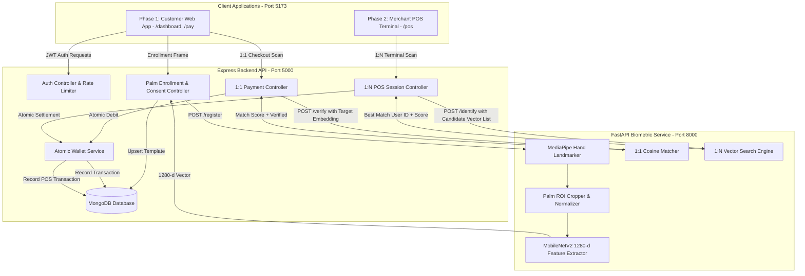

# 🖐️ Palm Pay — Biometric Palm Identification Payment Platform

[](https://github.com/your-username/palm-pay/actions)
[](LICENSE)
[](https://nodejs.org/)
[](https://fastapi.tiangolo.com/)
[](https://reactjs.org/)
[](https://tensorflow.org/)

**Palm Pay** is a contactless biometric payment platform modeled on enterprise systems deployed by **Tencent Weixin Palm Pay** (China) and **HandPay / NEOM** (Saudi Arabia). Users enroll their palm once, and subsequent payments are authorized by scanning their hand over standard optical cameras—matching an irreversible **1280-dimensional mathematical template**, never a stored photograph.

---

## 📌 Table of Contents
- [Core Principles & Privacy](#-core-principles--privacy)
- [1:1 Verification vs. 1:N Identification](#-11-verification-vs-1n-identification)
- [Architecture Diagram](#-architecture-diagram)
- [Biometric Computer Vision Pipeline](#-biometric-computer-vision-pipeline)
- [Phase 1: Customer Web App](#-phase-1-customer-web-app)
- [Phase 2: Merchant POS Web App](#-phase-2-merchant-pos-web-app)
- [Legal Compliance & Data Retention](#-legal-compliance--data-retention)
- [Quick Start Guide](#-quick-start-guide)
  - [Option A: Docker Compose (1-Click)](#option-a-docker-compose-1-click)
  - [Option B: Manual Startup (Step-by-Step)](#option-b-manual-startup-step-by-step)
- [Testing & Quality Assurance](#-testing--quality-assurance)
- [API Documentation](#-api-documentation)
- [Interview & System Design Deep Dive](#-interview--system-design-deep-dive)

---

## 🔒 Core Principles & Privacy

### Template-Based Biometrics (Zero Raw Image Storage)
$$\text{Live Camera Frame} \xrightarrow{\text{MediaPipe}} \text{Palm Detection} \xrightarrow{\text{Crop \& Normalization}} \text{MobileNetV2} \xrightarrow{} \text{1280-d Vector} \xrightarrow{} \text{Persist Template Only}$$

- **Zero Image Persistence:** Raw camera frames are processed in volatile memory only for the fraction of a second needed for feature extraction, and discarded immediately.
- **Irreversible Embeddings:** Only $L_2$-normalized 1280-dimensional float vectors are saved to the `PalmProfile` collection in MongoDB.
- **Fail-Closed Security:** If the biometric service is offline, transactions fail closed (`503 ML_SERVICE_UNAVAILABLE`) unless an authenticated 4-digit PIN fallback is provided.

---

## ⚡ 1:1 Verification vs. 1:N Identification

| Metric / Parameter | Phase 1: Customer Web App (`/pay`) | Phase 2: Merchant POS Web App (`/pos`) |
| :--- | :--- | :--- |
| **Authentication Mode** | **1:1 Verification** (Confirm claimed identity) | **1:N Identification** (Open-set customer identification) |
| **User Context** | Customer is logged in on personal device | Customer does **not** log in on merchant's terminal |
| **Inference Task** | Compare scan $\mathbf{v}_{\text{live}}$ against stored template $\mathbf{v}_{\text{user}}$ | Compare scan $\mathbf{v}_{\text{live}}$ across all candidate vectors $\{\mathbf{v}_1, \dots, \mathbf{v}_N\}$ |
| **Calibrated Threshold** | Cosine Similarity $\ge 0.65$ | Cosine Similarity $\ge 0.78$ (Stricter for open-set accuracy) |
| **Complexity** | $O(1)$ Direct comparison | $O(N)$ Linear sweep ($O(1)$ via FAISS / Vector DB at scale) |

---

## 🏛️ Architecture Diagram



---

## 📱 Phase 1: Customer Web App

- **`/` & `/register`**: Account creation with automatic redirection to palm biometric enrollment.
- **`/palm-register`**: Informed consent screen followed by real-time camera scanning with hand-outline guide overlay and live state machine (*Looking for palm...* $\rightarrow$ *Palm detected ✓* $\rightarrow$ *Generating 1280-d embedding...* $\rightarrow$ *Registered ✓*).
- **`/dashboard`**: Real-time wallet balance, **`[ Pay ]`** CTA, **`[ Add Money ]`** top-up modal, recent transactions, and POS launcher.
- **`/pay` & `/pay/scan`**: Amount entry $\rightarrow$ 1:1 biometric verification $\rightarrow$ live **`{match_score}% Match`** display $\rightarrow$ instant receipt + 4-digit PIN fallback challenge.
- **`/transactions`**: Date-grouped ledger (Today, Yesterday, Earlier), category filters, and **CSV Statement Export**.
- **`/profile`**: Displays Palm ID status, **`[ Re-register Palm ]`** (upsert), and **`[ Delete Palm Data ]`** (GDPR right to erasure).

---

## 🏪 Phase 2: Merchant POS Web App

- **`/pos` (Amount Entry)**: Merchant enters bill amount ($\text{₹}$) and creates an active POS checkout session with a 90-second MongoDB TTL index.
- **`/pos/scan` (1:N Identification)**: Customer holds hand over terminal scanner $\rightarrow$ backend runs 1:N vector search across database $\rightarrow$ displays **Customer Confirmation Card** (*"Identified: Samantha Patel, 98.4% Match"*).
- **`/pos/receipt` (Receipt)**: Displays payment confirmation, transaction reference, 1:N biometric badge, and updated customer balance.

---

## 🛡️ Legal Compliance & Data Retention

| Regulation | Implementation in Palm Pay |
| :--- | :--- |
| **GDPR Article 9** (Special Category Data) | Explicit informed consent recorded at `/palm-register` and stamped on user profile (`consentGivenAt`). |
| **GDPR Article 17** (Right to Erasure) | `DELETE /api/palm` permanently purges the user's `PalmProfile` and embedding arrays from MongoDB. |
| **Illinois BIPA** | Formal biometric policy: zero raw photo retention; template retention strictly limited to active account lifecycle. |

---

## 🚀 Quick Start Guide

### Option A: Docker Compose (1-Click)
```bash
docker-compose up --build
```
- Frontend: `http://localhost`
- Backend API: `http://localhost:5000`
- Python ML Service: `http://localhost:8000/docs`

---

### Option B: Manual Startup (Step-by-Step)

#### 1. Start Python ML Biometric Microservice (Port 8000)
```bash
cd palm_ml
pip install -r requirements.txt
uvicorn app:app --host 127.0.0.1 --port 8000 --reload
```
*Verify: Visit `http://127.0.0.1:8000/health` $\rightarrow$ should return `{"status": "ok", "model_loaded": true}`.*

#### 2. Start Express Backend (Port 5000)
```bash
cd backend
npm install
npm run dev
```
*Verify: Visit `http://localhost:5000/api/health` $\rightarrow$ should return `{"mongo": "ok", "mlService": "ok"}`.*

#### 3. Start React Frontend (Port 5173)
```bash
cd frontend
npm install
npm run dev
```
*Visit `http://localhost:5173` to launch the application.*

---

## 🧪 Testing & Quality Assurance

### Run Backend Test Suite
```bash
cd backend
npm test
```
*Executes unit and integration tests covering atomic wallet balance mutations, double-spending prevention, auth validation, and health checks.*

### Run ML Service Tests
```bash
cd palm_ml
pytest
```

---

## 🔌 API Documentation
- Interactive Swagger / OpenAPI UI: Available at `http://127.0.0.1:8000/docs`.
- Postman Collection: Pre-configured request collection committed in [`postman_collection.json`](file:///c:/Users/Mahipal%20singh%20deora/OneDrive/Desktop/setup/postman_collection.json).

---

## 📚 Interview & System Design Deep Dive
For technical talking points, system design justifications (why embeddings over photos, race condition prevention, 1:1 vs 1:N scaling), see [`NOTES.md`](file:///c:/Users/Mahipal%20singh%20deora/OneDrive/Desktop/setup/NOTES.md).
