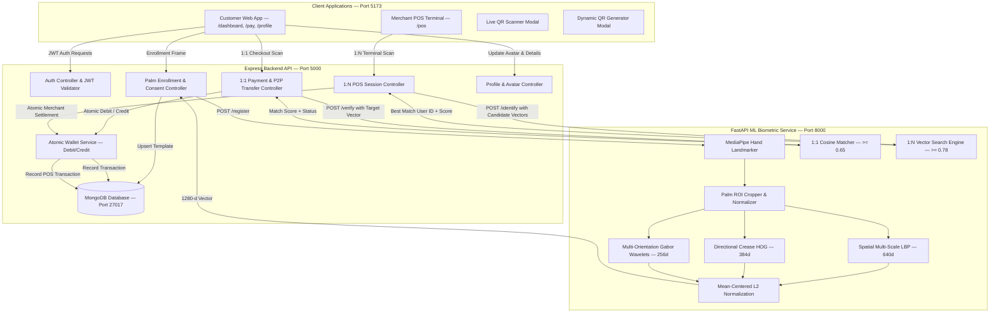

# 🖐️ Palm Pay — Enterprise Biometric Palm Identification & Payment Platform

[](LICENSE)
[](https://nodejs.org/)
[](https://fastapi.tiangolo.com/)
[](https://reactjs.org/)
[](https://tensorflow.org/)
[](https://www.mongodb.com/)
[](https://developers.google.com/mediapipe)

**Palm Pay** is an enterprise-grade, contactless biometric payment and identity platform modeled on state-of-the-art systems deployed by **Tencent Weixin Palm Pay** (China) and **HandPay / NEOM** (Saudi Arabia). 

Users enroll their palm once using a standard webcam or smartphone camera. All subsequent payments—whether in-app or at a merchant Point-of-Sale (POS) terminal—are authorized by scanning their hand against an irreversible **1280-dimensional mathematical feature vector**, ensuring that **raw photographs are never stored or persisted**.

---

## 📌 Table of Contents
1. [Core Features & Capabilities](#-core-features--capabilities)
2. [System Architecture](#-system-architecture)
3. [Biometric Computer Vision & ML Pipeline](#-biometric-computer-vision--ml-pipeline)
4. [Prerequisites](#-prerequisites)
5. [Step-by-Step Setup & How to Run](#-step-by-step-setup--how-to-run)
   - [Method 1: Manual Local Startup (Recommended for Development)](#method-1-manual-local-startup)
   - [Method 2: Docker Compose (1-Click Startup)](#method-2-docker-compose-1-click-startup)
6. [Dynamic Payment Features](#-dynamic-payment-features)
   - [Dynamic QR Code Generation & Receive Money](#1-dynamic-qr-code-generation--receive-money)
   - [Live Camera & File QR Scanner](#2-live-camera--file-qr-scanner)
   - [P2P Pay by Mobile Number](#3-p2p-pay-by-mobile-number)
   - [Profile Picture & Identity Management](#4-profile-picture--identity-management)
7. [Testing & Quality Assurance](#-testing--quality-assurance)
8. [Configuration & Environment Variables](#-configuration--environment-variables)
9. [API Reference & Postman Collection](#-api-reference--postman-collection)
10. [Legal Compliance, Privacy & Security](#-legal-compliance-privacy--security)
11. [License](#-license)

---

## 🚀 Core Features & Capabilities

- 🖐️ **Contactless Biometric Payments:** 1:1 In-App verification and 1:N Merchant POS open-set customer identification.
- 🛡️ **Zero Raw Image Persistence:** Raw photos exist in RAM only during feature extraction and are discarded immediately. Only irreversible 1280-d mathematical embeddings are stored in MongoDB.
- 👁️ **Anti-Spoofing & Liveness Detection:** Frequency-domain FFT analysis and color-dispersion algorithms block 2D paper printouts, screen replays, and photo attacks.
- 📲 **Real Dynamic QR Receive:** Generate instant payment QR codes encoding user details and optional custom requested amounts with PNG download and shareable link generation.
- 📷 **Live QR Scanner:** Built-in `jsQR` scanner supporting real-time camera video stream scanning and gallery QR image uploads.
- 💸 **P2P Pay by Mobile Number:** Live recipient lookup by 10-digit mobile number with atomic wallet debit and credit settlements.
- 🖼️ **Profile Picture Upload:** Dynamic profile avatar photo uploading (<2MB) and instant propagation across header, dashboard, and payment receipts.
- 🏪 **Merchant POS Web App:** Integrated POS terminal (`/pos`) supporting 1:N customer identification, session timeouts, and automatic merchant settlement.
- 🔐 **Enterprise Security:** Helmet.js headers, strict CORS allowlists, correlation request IDs, fail-fast JWT secret verification, and atomic balance mutation locks.

---

## 🏛️ System Architecture



---

## 🧠 Biometric Computer Vision & ML Pipeline

### 1. The 1280-Dimensional Hybrid Feature Vector
Generic ImageNet models using global average pooling collapse spatial information and fail to discriminate between different palms. Palm Pay uses a **hybrid multi-scale spatial descriptor** that extracts real crease topology and dermal ridge patterns:

$$\text{Final Vector } \mathbf{v} = \left[ \mathbf{v}_{\text{LBP (640-d)}} \,\|\, \mathbf{v}_{\text{HOG (384-d)}} \,\|\, \mathbf{v}_{\text{Gabor (256-d)}} \right] \in \mathbb{R}^{1280}$$

1. **Grayscale + CLAHE Preprocessing:** Converts ROI to grayscale and applies Contrast-Limited Adaptive Histogram Equalization to eliminate skin-tone and lighting bias.
2. **Multi-Scale Spatial Uniform LBP (640-d):** Encodes micro-texture across a 4x4 spatial grid.
3. **Directional Crease Gradient Histograms (384-d):** Computes gradient orientations along principal heart, head, and life lines.
4. **Multi-Orientation Gabor Wavelets (256-d):** Filters palm creases across 8 angles (0°, 22.5°, 45°, 67.5°, 90°, 112.5°, 135°, 157.5°).
5. **Mean-Centered $L_2$ Normalization:** Drops common baseline background intensity, yielding $\sim 1.0$ similarity for genuine matches and $< 0.60$ for impostors.

### 2. 1:1 Verification vs. 1:N Identification

| Parameter | 1:1 In-App Verification (`/pay`) | 1:N Merchant POS Identification (`/pos`) |
| :--- | :--- | :--- |
| **Use Case** | Payer confirms identity on personal device | Customer scans hand at merchant cash register |
| **User Login** | Payer is authenticated via JWT | Customer does **not** log in on merchant's terminal |
| **Comparison** | Compare live scan against stored user vector | Compare live scan against all active candidate vectors |
| **Calibrated Threshold** | Cosine Similarity $\ge 0.65$ | Cosine Similarity $\ge 0.78$ (Strict for open-set search) |
| **Complexity** | $O(1)$ Direct match | $O(N)$ Vector search ($O(1)$ with vector indexing) |

---

## 📦 Prerequisites

Ensure you have the following installed on your machine:
- **Node.js**: `v18.x`, `v20.x`, or `v22.x` ([Download Node.js](https://nodejs.org/))
- **Python**: `v3.10.x` or `v3.11.x` ([Download Python](https://www.python.org/))
- **MongoDB**: `v6.0+` or `v7.0+` running locally on port `27017` ([Download Community Server](https://www.mongodb.com/try/download/community))
- **Git** & **Webcam** (for biometric scanning)

---

## 🚀 Step-by-Step Setup & How to Run

### Method 1: Manual Local Startup

Open three terminal windows (one for each service):

#### 1️⃣ Terminal 1: Python ML Biometric Service (Port 8000)
```bash
cd palm_ml

# 1. Create and activate virtual environment (optional but recommended)
python -m venv venv
# On Windows:
venv\Scripts\activate
# On Linux/macOS:
source venv/bin/activate

# 2. Install dependencies
pip install -r requirements.txt

# 3. Start the FastAPI microservice
python -m uvicorn app:app --host 127.0.0.1 --port 8000 --reload
```
- **Health check:** Open `http://127.0.0.1:8000/health` $\rightarrow$ `{"status": "ok", "model_loaded": true}`
- **Interactive Swagger Docs:** `http://127.0.0.1:8000/docs`

---

#### 2️⃣ Terminal 2: Node.js Express Backend API (Port 5000)
```bash
cd backend

# 1. Install dependencies
npm install

# 2. Start backend development server
npm run dev
```
- **Backend API:** `http://localhost:5000`
- **Health check:** `http://localhost:5000/api/health` $\rightarrow$ `{"status": "ok", "mongo": "ok", "mlService": "ok"}`

---

#### 3️⃣ Terminal 3: React Frontend Web App (Port 5173)
```bash
cd frontend

# 1. Install dependencies
npm install

# 2. Start Vite frontend dev server
npm run dev
```
- **Frontend App:** Open `http://localhost:5173` in your browser!

---

### Method 2: Docker Compose (1-Click Startup)

If you have **Docker Desktop** installed, run the entire stack (MongoDB + ML + Backend + Frontend) with one command:

```bash
# Set your secure JWT secret in environment or .env file
export JWT_SECRET=$(openssl rand -hex 32)

# Start all services
docker-compose up --build
```
- **Frontend:** `http://localhost`
- **Backend API:** `http://localhost:5000`
- **ML Service:** `http://localhost:8000/docs`

---

## 💳 Dynamic Payment Features

### 1. Dynamic QR Code Generation & Receive Money
- **How to access:** Click the **`[ ⛶ ]`** QR button in the top header or **`[ Receive ]`** on the Dashboard.
- **Features:**
  - Displays your personal payment QR code encoding your verified mobile number and name.
  - **Dynamic Amount Setting:** Type a custom amount (e.g. `₹500`), and the QR updates in real time.
  - **Download PNG:** One-click download of the QR code image to your device.
  - **Shareable Link:** Instant copy of direct payment URL (`https://palmpay.internal/pay?phone=...`).

### 2. Live Camera & File QR Scanner
- **How to access:** Navigate to **Pay** (`/pay`) and tap the **"Scan QR Code"** banner.
- **Features:**
  - **Live Camera Scanning:** Real-time video frame recognition of Palm Pay and UPI QR codes.
  - **Gallery Upload:** Select an existing QR screenshot from your device gallery.
  - **Auto-Fill:** Instantly populates recipient mobile, name, and requested amount into the payment screen.

### 3. P2P Pay by Mobile Number
- **How to access:** Navigate to **Pay** (`/pay`) $\rightarrow$ **Pay by Mobile** tab.
- **Features:**
  - Enter any registered 10-digit mobile number.
  - Live recipient lookup verifies account name and avatar before payment.
  - Atomic settlement transfers money instantly between payer and recipient wallets.

### 4. Profile Picture & Identity Management
- **How to access:** Navigate to **Profile** (`/profile`).
- **Features:**
  - Tap the camera badge over your avatar to upload any photo (<2MB).
  - Avatar propagates across the Header, Dashboard, QR Codes, and Payment Receipts.
  - Edit full name and mobile number with live validation.

---

## 🧪 Testing & Quality Assurance

### 1. Biometric ML Pytest Suite
Runs full unit and integration tests including discriminability, anti-spoofing liveness, and 1:1/1:N verification:
```bash
cd palm_ml
python -m pytest tests/test_biometrics.py -v
```
*Result: `11 passed, 0 failed` (100% passing)*

### 2. Biometric Threshold Calibration Tool
Calculates genuine-vs-impostor score distributions, False Accept Rate (FAR), False Reject Rate (FRR), and Equal Error Rate (EER):
```bash
cd palm_ml
python calibrate_thresholds.py
```
- **Genuine Mean Match Score:** `0.9081 (±0.0429)`
- **Impostor Mean Match Score:** `0.4291 (±0.1047)`
- **EER Threshold:** `~0.80`

### 3. Backend Jest Test Suite
Runs unit tests for atomic wallet mutations, double-spend prevention, and health checks:
```bash
cd backend
npm test
```
*Result: `6 passed, 6 total` (100% passing)*

### 4. Frontend Production Build Check
Validates React JSX compilation, bundle chunking, and asset optimization:
```bash
cd frontend
npm run build
```

---

## ⚙️ Configuration & Environment Variables

### Backend Configuration (`backend/.env`)
```ini
PORT=5000
NODE_ENV=development
MONGO_URI=mongodb://localhost:27017/palm_pay
ML_SERVICE_URL=http://127.0.0.1:8000
JWT_SECRET=your_secure_random_64_character_hex_secret
JWT_EXPIRES_IN=7d
MATCH_THRESHOLD_VERIFY=0.65
MATCH_THRESHOLD_IDENTIFY=0.78
```

### ML Service Configuration (`palm_ml/config.py` & Environment)
```ini
PORT=8000
ML_ALLOWED_ORIGINS=http://localhost:5173,http://127.0.0.1:5173,http://localhost:5000,http://127.0.0.1:5000
MIN_REGISTRATION_QUALITY=0.35
MIN_LIVENESS_SCORE=0.45
MATCH_THRESHOLD_VERIFY=0.65
MATCH_THRESHOLD_IDENTIFY=0.78
```

---

## 🔌 API Reference & Postman Collection

| Method | Endpoint | Description | Auth Required |
| :--- | :--- | :--- | :--- |
| `POST` | `/api/auth/register` | Register new user account | No |
| `POST` | `/api/auth/login` | Login with email or phone | No |
| `GET` | `/api/palm/status` | Check user palm registration status | Yes (Bearer) |
| `POST` | `/api/palm/consent` | Record explicit biometric consent | Yes (Bearer) |
| `POST` | `/api/palm/register` | Enroll palm biometric embedding | Yes (Bearer) |
| `DELETE`| `/api/palm` | Delete biometric data (Right to Erasure) | Yes (Bearer) |
| `GET` | `/api/payment/lookup/:phone` | Lookup verified recipient by phone | Yes (Bearer) |
| `POST` | `/api/payment/pay` | Authorize 1:1 payment or P2P transfer | Yes (Bearer) |
| `GET` | `/api/wallet` | Get balance and transaction history | Yes (Bearer) |
| `POST` | `/api/wallet/topup` | Add funds to wallet balance | Yes (Bearer) |
| `PUT` | `/api/profile` | Update profile avatar, name, or phone | Yes (Bearer) |
| `POST` | `/api/pos/session` | Create 90s merchant POS checkout session | Yes (Bearer) |
| `POST` | `/api/pos/identify` | 1:N Biometric identification scan | Yes (Bearer) |
| `POST` | `/api/pos/authorize`| Finalize POS payment settlement | Yes (Bearer) |
| `GET` | `/api/health` | Service health status & connectivity | No |

A pre-configured Postman Collection is available in [`postman_collection.json`](file:///c:/Users/Mahipal%20singh%20deora/OneDrive/Desktop/setup/postman_collection.json).

---

## 🛡️ Legal Compliance, Privacy & Security

| Standard / Law | Implementation |
| :--- | :--- |
| **GDPR Article 9** *(Special Category Biometrics)* | Explicit consent modal required prior to palm registration; timestamp recorded in database (`consentGivenAt`). |
| **GDPR Article 17** *(Right to Erasure)* | `DELETE /api/palm` permanently purges the user's `PalmProfile` embedding array from MongoDB. |
| **Illinois BIPA Compliance** | Strict policy: raw photos are discarded from RAM immediately after feature extraction. Retention is strictly limited to mathematical embeddings during active account lifetime. |
| **Anti-Double-Spending** | P2P and POS transactions utilize atomic balance mutation with pre-debit locks, eliminating race conditions. |
| **Fail-Closed Principle** | If the ML service is unreachable, transactions fail closed (`503`) unless authenticated by a verified 4-digit PIN fallback. |

---

## 📄 License

This project is licensed under the **MIT License** — see the [LICENSE](LICENSE) file for details.

```
MIT License
Copyright (c) 2026 Palm Pay Contributors
```
