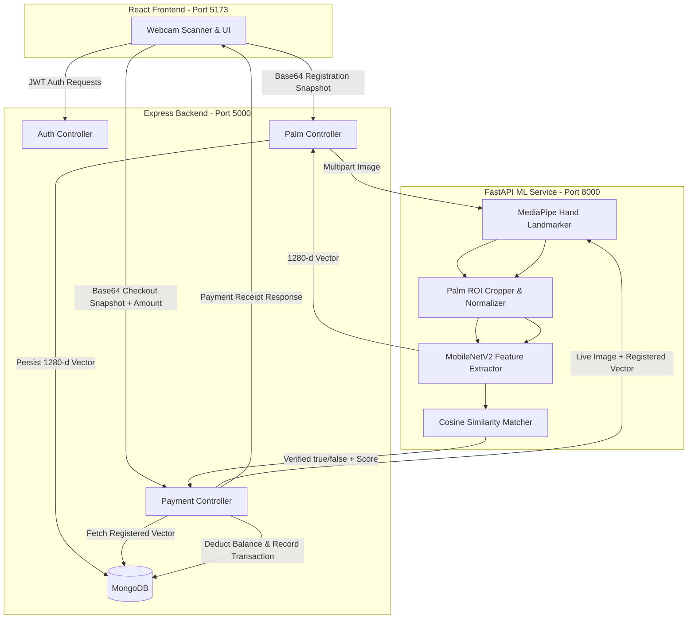

# 🖐️ Palm Pay — Biometric Palm Authentication & Payment System

[](https://github.com/)
[](LICENSE)

**Palm Pay** is a contactless, biometric payment platform that enables users to register their unique palm print biometrics and authorize instant wallet payments using a standard RGB webcam—eliminating the need for physical cards, PINs, or phone OTPs.

---

## 📌 Table of Contents
- [Architecture & System Design](#-architecture--system-design)
- [How Biometric Verification Works](#-how-biometric-verification-works)
- [Project Directory Structure](#-project-directory-structure)
- [Prerequisites](#-prerequisites)
- [Step-by-Step Setup & Running](#-step-by-step-setup--running)
- [API Reference](#-api-reference)
- [Environment Configuration](#-environment-configuration)
- [Troubleshooting & FAQs](#-troubleshooting--faqs)

---

## 🏛️ Architecture & System Design

The system follows a **decoupled modular service architecture** separating business logic, transaction handling, and heavy computer vision / deep learning inference:



---

## 🔬 How Biometric Verification Works

1. **Palm Detection & Region Extraction**:
   - Uses **Google MediaPipe Hands** to locate key 21 hand landmarks in real time.
   - Calculates bounding coordinates around the palm center and applies safety margin padding.
   - Resizes and crops the palm Region of Interest (ROI) to $224 \times 224$ pixels.
2. **Deep Feature Embedding**:
   - Passes the cropped palm image through a pretrained **MobileNetV2** backbone (global average pooling).
   - Generates a **1280-dimensional feature vector** representing unique dermal ridges and hand proportions.
   - Normalizes the vector using L2-norm ($||\vec{v}|| = 1.0$).
3. **1:1 Cosine Similarity Matching**:
   - During payment, the live vector $\vec{a}$ is compared against the stored vector $\vec{b}$:
     $$\text{Similarity}(\vec{a}, \vec{b}) = \frac{\vec{a} \cdot \vec{b}}{\|\vec{a}\| \|\vec{b}\|}$$
   - If $\text{Similarity} \ge \text{MATCH\_THRESHOLD}$ (default: `0.70`), the payment is authenticated.

---

## 📂 Project Directory Structure

```text
setup/
├── backend/                  # Node.js + Express REST API
│   ├── controllers/          # Business logic (auth, palm, payment, wallet, transaction)
│   ├── middleware/           # JWT auth middleware
│   ├── models/               # Mongoose Schemas (User, PalmProfile, Transaction)
│   ├── routes/               # API endpoint definitions
│   ├── .env.example          # Backend environment template
│   ├── package.json          # Node dependencies
│   └── server.js             # Express entry point
├── frontend/                 # React 18 + Vite SPA
│   ├── src/
│   │   ├── components/       # Protected routes, navigation, shared UI
│   │   ├── pages/            # Dashboard, Login, Register, PalmRegister, PayWithPalm, Profile
│   │   ├── services/         # Axios API client with auth interceptors
│   │   ├── App.jsx           # React Router routes
│   │   └── index.css         # Modern design styles & animations
│   └── package.json          # Vite dependencies
└── palm_ml/                  # Python FastAPI + TensorFlow Service
    ├── app.py                # FastAPI endpoints (/register, /verify, /recognize, /health)
    ├── config.py             # Configs (MATCH_THRESHOLD = 0.70, IMAGE_SIZE = 224)
    ├── embedding.py          # MobileNetV2 embedding extractor
    ├── palm_utils.py         # MediaPipe palm cropping & cosine similarity
    ├── requirements.txt      # Python dependencies
    └── venv/                 # Python virtual environment
```

---

## ⚡ Prerequisites

- **Node.js**: v18.x or v20.x+ (`node -v`)
- **Python**: 3.10 to 3.12 (`python --version`)
- **MongoDB**: Local MongoDB instance running on `mongodb://127.0.0.1:27017` or MongoDB Atlas URI
- **Webcam**: Standard RGB webcam with browser camera permissions enabled

---

## 🚀 Step-by-Step Setup & Running

Open **3 separate terminal windows** to run the services concurrently:

### Terminal 1: Start FastAPI ML Service (Port 8000)
```bash
cd palm_ml

# Activate virtual environment (Windows PowerShell)
.\venv\Scripts\Activate.ps1

# (Optional: install dependencies if not already installed)
# pip install -r requirements.txt

# Start uvicorn server
uvicorn app:app --host 127.0.0.1 --port 8000 --reload
```
*Health Check*: Open [http://127.0.0.1:8000/health](http://127.0.0.1:8000/health) in your browser.

---

### Terminal 2: Start Node.js Backend (Port 5000)
```bash
cd backend

# Create .env from example if needed
cp .env.example .env

# (Optional: install dependencies)
# npm install

# Start backend server
npm run dev
```
*API Check*: Open [http://localhost:5000/](http://localhost:5000/) to verify API is active.

---

### Terminal 3: Start React Frontend (Port 5173)
```bash
cd frontend

# (Optional: install dependencies)
# npm install

# Start Vite dev server
npm run dev
```
*App URL*: Open [http://localhost:5173](http://localhost:5173) in your browser.

---

## 📡 API Reference

### 1. ML Service (`http://127.0.0.1:8000`)
| Method | Endpoint | Description | Payload |
| :--- | :--- | :--- | :--- |
| `GET` | `/health` | Health probe | None |
| `POST` | `/register` | Extract palm landmarks & return 1280-d vector | `multipart/form-data` with `file` (Image) |
| `POST` | `/verify` | Compare live palm image against registered vector | `multipart/form-data` with `file` (Image) + `target_embedding` (JSON array) |
| `POST` | `/recognize` | Generate vector embedding from image | `multipart/form-data` with `file` (Image) |

### 2. Backend API (`http://localhost:5000/api`)
| Method | Endpoint | Auth | Description |
| :--- | :--- | :---: | :--- |
| `POST` | `/auth/register` | No | Create user account with name, email, mobile, password, PIN |
| `POST` | `/auth/login` | No | Login using email/mobile and password -> returns JWT token |
| `POST` | `/palm/register` | **Yes** | Register palm biometrics; forwards image to ML service & saves embedding |
| `POST` | `/payment/pay` | **Yes** | Authorize payment via live palm image; deducts wallet balance upon match |
| `GET` | `/wallet/balance`| **Yes** | Fetch current wallet balance |
| `GET` | `/transactions` | **Yes** | Fetch user payment and wallet transactions ledger |
| `GET` | `/profile` | **Yes** | Retrieve user profile & biometric registration status |

---

## 🔒 Environment Configuration

Create a `.env` file in the `backend/` directory:

```env
PORT=5000
MONGO_URI=mongodb://127.0.0.1:27017/palm_pay
JWT_SECRET=your_jwt_secret_key_here
ML_SERVICE_URL=http://127.0.0.1:8000
```

---

## ❓ Troubleshooting & FAQs

1. **"No palm detected in the image"**:
   - Ensure the webcam has adequate lighting.
   - Position your open palm inside the round camera frame guide with fingers spread naturally.
2. **"Palm verification failed (similarity < 0.70)"**:
   - Ensure you are scanning the same hand registered with the account.
   - Keep the hand parallel to the camera without tilt.
   - You can adjust `MATCH_THRESHOLD` in [palm_ml/config.py](file:///c:/Users/Mahipal%20singh%20deora/OneDrive/Desktop/setup/palm_ml/config.py#L8) if testing in low-light conditions.
3. **"MongoDB connection failed"**:
   - Make sure your MongoDB service is running locally (`mongod` or MongoDB Compass connection to `127.0.0.1:27017`).
4. **"ML service is unavailable"**:
   - Verify Terminal 1 is running `uvicorn app:app --port 8000`.

---

## 📄 License
This project is open source and available under the [MIT License](LICENSE).
